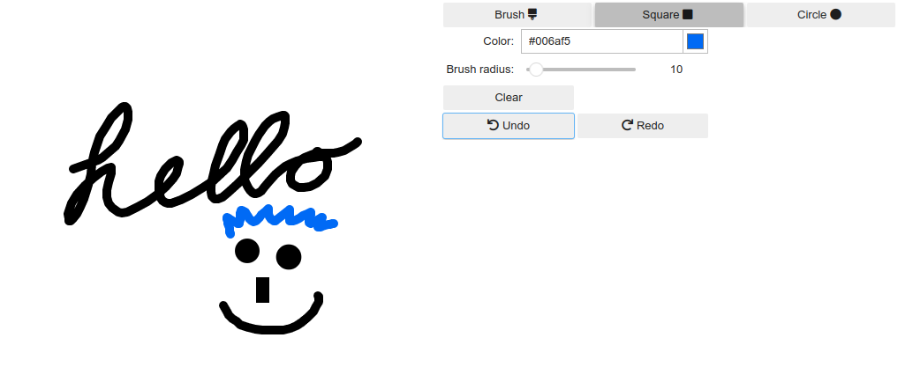

# Jupyter drawing utility
[](https://mybinder.org/v2/gh/rubenwiersma/ipycanvas_drawing/HEAD?labpath=examples%2Fexample_drawing.ipynb)

Small utility to make simple drawings in Jupyter notebooks with ipycanvas and ipywidgets.
Useful for getting quick user input in research prototypes, e.g., for masking or annotation.




## Install
```bash
pip install ipycanvas-drawing
```

## Usage
Create a simple drawing interface. Check out the notebook in `examples` for a more complete example.

```python
from ipycanvas_drawing import DrawingWidget

# Create a drawing widget
# You can set other setup parameters: background, alpha, default_style, default_radius
drawing_widget = DrawingWidget(width=500, height=500) 
# Show the drawing widget
drawing_widget.show()

# Get the image data as a numpy array
image_output = drawing_widget.get_image_data()
```

## Credits
Based on the [hand drawing example](https://github.com/martinRenou/ipycanvas/blob/master/examples/hand_drawing.ipynb) provided by @martinRenou, but adds some additional functionality like adding squares and ellipses and a 1-step undo.
